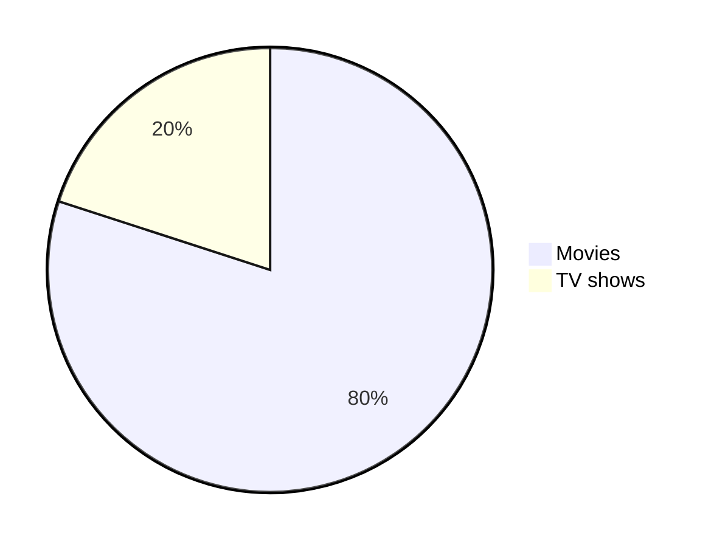

MARKDOWN CHEAT SHEET
====================
<!-- meta ------------------------------------------------------------------------------

Description ==  Cheatsheet MARKDOWN
Tags        ==  Cheatsheet MARKDOWN

Post_Type   ==  Cheatsheet
Preview     ==  cli
Author      ==  Loxcy

Version     == 0.1
Featured    == True
Visible     == False
Draft       == True

created_at  == 2022-01-10 00:00:00
published_at== 2022-01-10 00:00:00
updated_at   == 2022-01-10 00:00:00


---------------------------------------------------------------------------- endmeta -->
Sommaire:
---

- [Titre](#titre)  
        - [Titre h1 par soulignement](#titre-h1-par-soulignement)  
        - [Titre h2 par soulignement](#titre-h2-par-soulignement)  
        - [Niveau de titre defini par le nombre de "**#**"](#niveau-de-titre-defini-par-le-nombre-de)
- [Fomatage du texte](#fomatage-du-texte)


- ## Titre
    -  ### Titre h1 par soulignement
        ```md 
        MARKDOWN CHEAT SHEET
        ====================
        ```
    - ### Titre h2 par soulignement
        ```md
        Sommaire
        --------
        ```
    - ### Niveau de titre defini par le nombre de "**#**"
    
      - # Titre h1 `# Titre h1`
      - ## Titre h2 `## Titre h2`
      - ### Titre h3 `### Titre h3 `
      - #### Titre h4 `#### Titre h4 `
      - ##### Titre h5 `##### Titre h5 `
      - ###### Titre h6 `###### Titre h6 `

- ## Fomatage du texte :
    - `**bold text**` Texte simple **bold text** 
    - `*texte italique*` Texte simple *texte italique*
    - `***bold italic text***` Texte gras italique ***bold text*** 
    - ~~barré~~ `~~barré~~`
    -   @username
    -   *[HTML]: Hypertext Markup Language 

- ## Fomatage du code :
    - `` `code` `` `code`, ou ` ``` ` pour les blocks 
    
            ```md
            votre code ici
            ``` 

    - [lien](https://www.example.com) `[lien](https://www.example.com)`
    

    
- ## Mise en page :
    * > blockquote `> blockquote`

- ## Liste :

    * Liste ordonné

        1) 1er item     `1) 1er item`
        2. 2nd item     `2. 2nd item`
        3) 3ème item    `3) 3ème item`
        
    - Liste non ordonné
        - 1er item `- 1er item`
        - 2nd item `- 2nd item`
        - 3ème item `- 3ème item`

- ## Ligne de cassure :
    - `---` Ligne horizontale 
    
        ---

- ## Images :

    -  ``

         ``

        par reference: ![alt text][logo]

        [logo]: https://avatars.githubusercontent.com/u/96689254?s=40&v=4 "Logo Title Text 2" 

        ```
        ![alt text][logo]
        [logo]: https://avatars.githubusercontent.com/u/96689254?s=40&v=4 "Logo Title Text 2"
        ```
        Utiliser un Theme
        ```
        [](https://avatars.githubusercontent.com/u/96689254?s=40&v=4)
        
        or

        
        ```
- ## tableau :

	| Syntax | Description |
    | ------ | ----------- |
    | entete | Titre       |
    | Paragraphe | Texte   |

    ```md
    | Syntax | Description |
    | ------ | ----------- |
    | entete | Titre       |
    | Paragraphe | Texte   |
    ```

    aligner les collones
    ```
    | Fruit(left)      | Emoji(center) | Taste(right)     |
    | :---        |    :----:   |          ---: |
    | Mango is the king of Fruits      | :mango:       | Sweet and I love it  |
    | Lemon is good for health   | :lemon:        | Sour, mix it in the water     |
    ```
    | Fruit(left)      | Emoji(center) | Taste(right)     |
    | :---        |    :----:   |          ---: |
    | Mango is the king of Fruits      | :mango:       | Sweet and I love it  |
    | Lemon is good for health   | :lemon:        | Sour, mix it in the water     |

- ## liste de tache
    - [x] fait
    - [ ] pas fais

- ## Liens 
    Lien vers un site [Website](https://google.com)
    ```
    Lien vers un site [Website](https://google.com)
    ```

- ## Emoji
```
:mango:  :lemon: :man: :car:
```
:mango: :lemon: :man: :car:

- ## Video
    ```
    [](YOUTUBE VIDEO LINK)
    ```
    [](https://www.youtube.com/watch?v=DuGoIWZ4CN8&list=RDDuGoIWZ4CN8&start_radio=1)

- ## Boutons
  - simple  
    <kbd>cmd + shift + p</kbd>
  - espacé  
    <kbd> <br> cmd + shift + p <br> </kbd>
  - lien
    - <kbd>[Markdown-Cheatsheet](https://github.com/lifeparticle/Markdown-Cheatsheet)</kbd>
    - [<kbd>Markdown-Cheatsheet</kbd>](https://github.com/lifeparticle/Markdown-Cheatsheet)


## Mathematical Expressions

1. **Inline expressions:**

    **Syntax**

    ```plain
    $<<mathematical expression>>$
    ```

    Replace `<<mathematical expression>>` with your expression.

    **Example**

    ```plain
    $\sqrt{3}+1$
    ```

    **Output**

    $\sqrt{3}+1$

2. **Block Expressions:**

    **Syntax**

    ```plain
    $$<<mathematical expression>>$$
    ```

    **Example**

    ```plain
    $$\sqrt{3}+1$$
    ```

    **Output**

    $$\sqrt{3}+1$$

3. **Mixed Expressions:**

    **Syntax**
    
    ```
    When $a \ne 0$, there are two solutions to $(ax^2 + bx + c = 0)$ and they are 
    
    $$ x = {-b \pm \sqrt{b^2-4ac} \over 2a} $$
    ```

    **Output**

    When $a \ne 0$, there are two solutions to $(ax^2 + bx + c = 0)$ and they are 
    
    $$ x = {-b \pm \sqrt{b^2-4ac} \over 2a} $$

For more information on how to write mathematical expressions, [visit this page](https://en.wikibooks.org/wiki/LaTeX/Mathematics).

## DropDown

1. DropDown with Open:
 <br>**Syntax**
 ```
 <details open>
 <summary>Want to know more? </summary>
 <br>
 This is called a DropDown.
 <br>Yes! This is possible using Markdown.
 <br>You can hide some content from the user.
 <br>They can view the detailed message only when they click.
 </details>
 ```
 **Output**
 <details open>
 <summary>Want to know more?</summary>
 <br>
 This is called a DropDown.
 <br>Yes! This is possible using Markdown.
 <br>You can hide some content from the user.
 <br>They can view the detailed message only when they click.
 </details>

 **Explanation**
 <br>The *details* tags are used to indicate that we want a dropdown.
 <br>The keyword *open* in details tag is causing the dropdown to stay opened even before the user clicks on it, which messes up the fun!
 <br>It looks like a question and answer - this is not our purpose, we fix this in the below example.
 <br>Between the *summary* tags, we write the heading/content to be displayed.
 <br>After *summary*, we can include the detailed content.
 <br>However, when a user clicks on the arrow, the detailed content gets hidden; with another the click, the content is displayed again.

2. DropDown without Open:
 <br>**Syntax**
 ```
 <details>
 <summary>Want to know more? Click Here</summary>
 <br>
 This is called a DropDown.
 <br>Yes! This is possible using Markdown.
 <br>You can hide some content from the user.
 <br>They can view the detailed message only when they click.
 </details>
 ```
 **Output**
 <details>
 <summary>Want to know more? Click Here</summary>
 <br>
 This is called a DropDown.
 <br>Yes! This is possible using Markdown.
 <br>You can hide some content from the user.
 <br>They can view the detailed message only when they click.
 </details>

 **Explanation**
 <br>The *details* tags are used to indicate that we want a dropdown.
 <br>This is what we require, the detailed content should be hidden initially. With a click, the information should be displayed.
 <br>Between the *summary* tags, we write the heading/content to be displayed inside or what we refer to as **DROPDOWN TITLE**.
 <br>After *summary*, we can include the detailed content, this will be shown only when the user clicks the dropdown title.

## Diagrams

**Syntax:**
- Use the *mermaid* syntax
- Additional syntax: TD means Top Down, LR means Left Right, BT means Bottom Top, RL means Right Left 

TD variant
```
    ```mermaid
        graph TD;
            A-->B;
            B-->C;
            C-->D;
            D-->E;
    ```
```

**Output:**

 ```mermaid
        graph TD;
            A-->B;
            B-->C;
            C-->D;
            D-->E;
```

LR variant
```
    ```mermaid
        graph LR;
            A-->B;
            B-->C;
            C-->D;
            D-->E;
    ```
```

**Output:**

 ```mermaid
        graph LR;
            A-->B;
            B-->C;
            C-->D;
            D-->E;
```

BT variant
```
    ```mermaid
        graph BT;
            A-->B;
            B-->C;
            C-->D;
            D-->E;
    ```
```

**Output:**

 ```mermaid
        graph BT;
            A-->B;
            B-->C;
            C-->D;
            D-->E;
```

RL variant
```
    ```mermaid
        graph RL;
            A-->B;
            B-->C;
            C-->D;
            D-->E;
    ```
```


 ```mermaid
        graph RL;
            A-->B;
            B-->C;
            C-->D;
            D-->E;
```

```
    ```mermaid
    pie
    "Movies" : 80
    "TV shows" : 20
    ```
```
**Output:**


## FootNote

**Explanation:**
<br>Footnotes allow you to add notes and references without cluttering the body of the document. 
<br>When you create a footnote, a superscript number with a link appears where you added the footnote reference. 
<br>Readers can click the link to jump to the content of the footnote at the bottom of the page.

**Syntax:**

```
Here's a simple footnote,[^1] and here's a longer one.[^bignote]

[^1]: This is the first footnote.

[^bignote]: Here's one with multiple paragraphs and code.

```
**Output:**

Here's a simple footnote,[^1] and here's a longer one.[^bignote]

[^1]: This is the first footnote.

[^bignote]: Here's one with multiple paragraphs and code.


## Comments

**Explanation:**
<br>Comments are text notes added to a program or a document to provide explanatory information.
<br>You can hide content from the rendered Markdown by placing the content in a comment.


**Syntax**

```
This is Line Number 1. 
<!---This is Line Number 2 and would not be rendered as this is a comment. --->
This is Line Number 3.
```

**Output**

This is Line Number 1. 
<!---This is Line Number 2 and would not be rendered as this is a comment. --->
This is Line Number 3.

